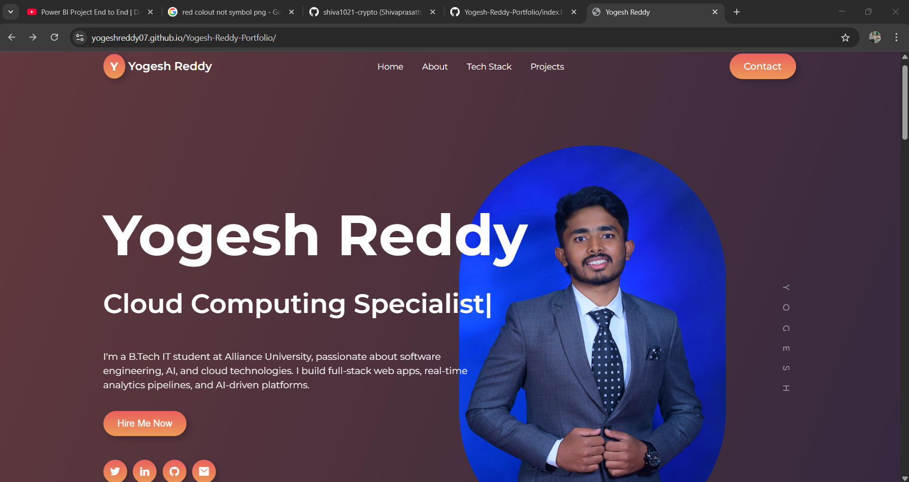

# 🌐 Yogesh Reddy - Portfolio Website

Welcome to the **personal portfolio** of **Yogesh Reddy** — a place where I showcase my projects, skills, and passion for technology. This portfolio reflects my journey through **Cloud Computing**, **Full-Stack Development**, and continuous learning.

🔗 **Live Website**: [yogeshreddy07.github.io/Yogesh-Reddy-Portfolio](https://yogeshreddy07.github.io/Yogesh-Reddy-Portfolio)

---

## 📸 Preview



> *This is a snapshot of the live portfolio homepage.*

---

## 🧰 Technologies Used

- 💻 **HTML5**, **CSS3**, **JavaScript**
- 📱 Responsive Web Design (Mobile-First)
- 🧭 **ScrollReveal.js** – for scroll-based animations
- 🎨 **Remix Icons** – clean, scalable icons

---

## ✨ Features

- ✅ Clean and modern UI/UX design
- ✅ Fully responsive on mobile, tablet, and desktop
- ✅ Introduction, Projects, About, and Contact sections
- ✅ Resume download functionality
- ✅ Linked social and GitHub profiles
- ✅ Scroll animations for smoother experience

---

## 📁 Folder Structure

```bash
📦 Yogesh-Reddy-Portfolio
├── assets/                 # Images and icons
│   └── sample-homepage.png
├── index.html              # Main HTML page
├── styles.css              # CSS styling
├── main.js                 # JS for animations & interactions
└── README.md               # Documentation (this file)
```
---

---

## 🔧 How to Run Locally

```bash
git clone https://github.com/Yogeshreddy07/Yogesh-Reddy-Portfolio.git
cd Yogesh-Reddy-Portfolio
# Then open index.html in your preferred browser
```
---

## 🙌 Let's Connect

- 📧 **Email**: [yogeshreddys07@gmail.com](mailto:yogeshreddys07@gmail.com)  
- 💼 **LinkedIn**: [linkedin.com/in/yogeshreddy07](https://linkedin.com/in/yogeshreddy07)  
- 🐱 **GitHub**: [github.com/Yogeshreddy07](https://github.com/Yogeshreddy07)

---

## 📃 License

This repository is open-source and intended for **learning**, **sharing**, and **growth**.  
Feel free to **fork**, **build on it**, and **give credit where due**. 🙏

> _“The beautiful thing about learning is that nobody can take it away from you.”_  
> — **B.B. King**


